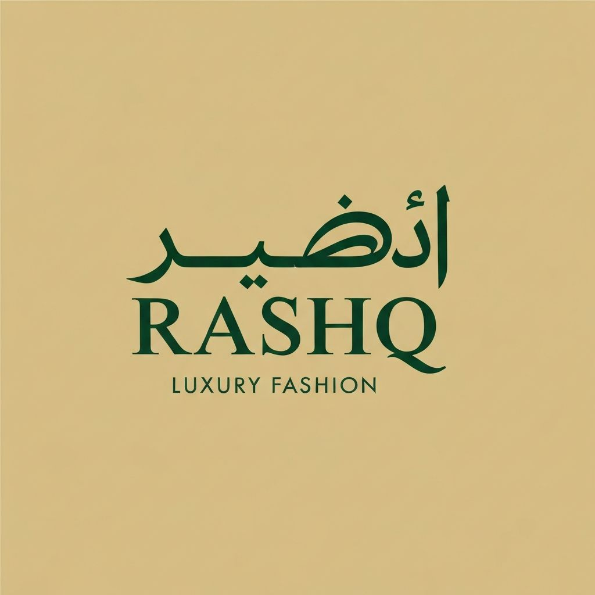

# Rashq Online Store (Next.js Frontend)



Rashq is a modern clothing brand that blends Middle Eastern heritage with contemporary fashion. This online store is the brand’s digital storefront, built with **Next.js** and **React**, offering a fast, responsive, and seamless shopping experience.

## Live Demo

[https://rashq-online-store-nextjs-frontend.vercel.app](#)

---

## Features

- Browse products with categories and filtering  
- Add products to the shopping cart and checkout  
- Fully responsive design for mobile and desktop  
- Admin dashboard for managing products (optional for future)  
- Optimized performance and SEO with Next.js

---

## Tech Stack

- **Frontend:** Next.js, React, Tailwind CSS  
- **Backend (planned/future):** Node.js, Express  
- **Database (planned/future):** MongoDB  
- **Payments (planned/future):** Stripe API  

---

## Installation

Clone the repository:

```bash
git clone https://github.com/yourusername/Rashq-Online-Store---Next.js-Frontend.git
cd Rashq-Online-Store---Next.js-Frontend
